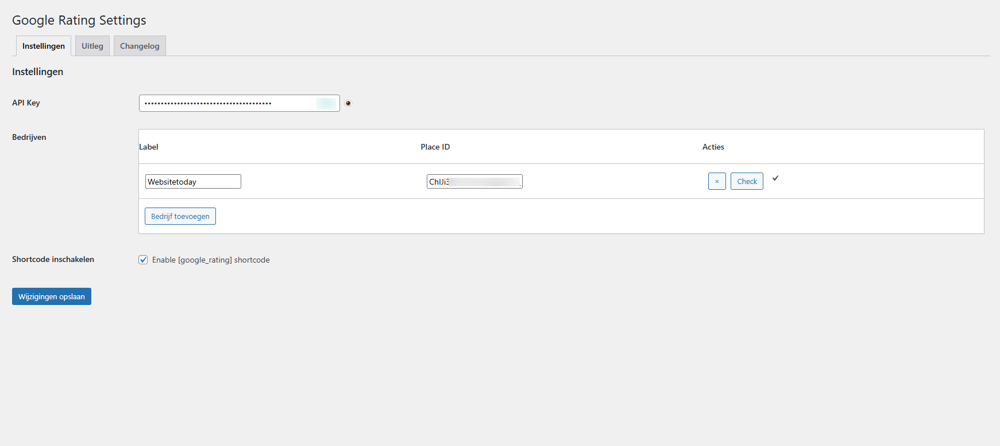
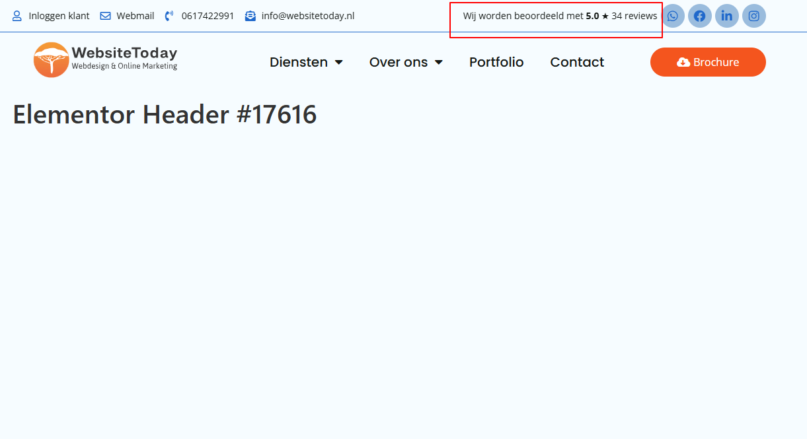
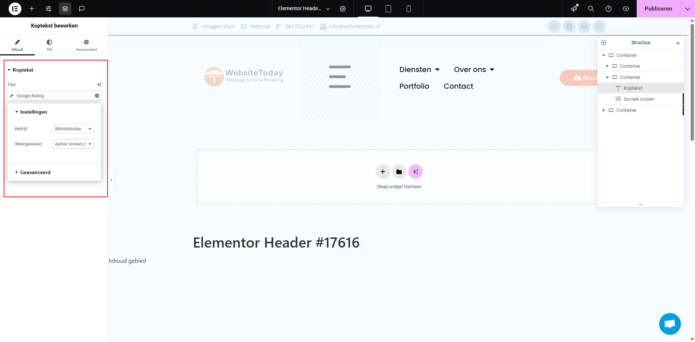

=== Google Rating Dynamic Tags Elementor ===
Contributors: Websitetoday.nl  
Tags: elementor, google, rating, dynamic-tags, cache, place-id  
Requires at least: 5.0  
Tested up to: 6.5  
Stable tag: main  
License: GPLv2 or later  
License URI: https://www.gnu.org/licenses/gpl-2.0.html  

== Description ==
Toon eenvoudig de Google Bedrijfsbeoordelingen (gemiddelde score, aantal reviews en link naar reviews) rechtstreeks in je content:

* **Elementor Dynamic Tag**: gebruik de Google Rating als tekst, nummer, ster of gecombineerde weergave.  
* **Shortcode**: voeg de rating of het aantal reviews toe via `[google_rating field="rating_star"]`.  
* **Cache & Force Refresh**: Google-data wordt maximaal 1x per week automatisch opgehaald en lokaal opgeslagen. Handmatig verversen kan via de “Ververs data” knop.  
* **Veilig & efficiënt**: Caching beperkt het aantal API-calls tot het minimum (max. 1 per week), dus geen onverwachte kosten!  
* **Volledig te stylen** via CSS en geschikt voor elke Elementor PRO website.  
* **Uninstall Cleanup**: bij deïnstallatie verwijdert de plugin alle instellingen en transients, zodat je opnieuw met een schone lei kunt beginnen.  
* **Automatische updates** via GitHub Releases (PUC v5).  

== Installation ==
1. Upload de map `google-rating-dynamic-tags-elementor-plugin` naar de `/wp-content/plugins/` directory.  
2. Activeer de plugin via **Plugins → Geïnstalleerde plugins**.  
3. (Optioneel) Installeer Elementor Pro als je de Dynamic Tag-functionaliteit wilt gebruiken.  
4. Ga naar **Google Rating → Instellingen** en vul je Google Places **API Key** en **Place ID** in.  
   - Klik op het **?** icoontje naast het veld voor uitleg en een rechtstreekse link.
5. De data wordt automatisch maximaal 1x per week opgehaald. Wil je direct verversen? Klik op **Ververs data**.  

== Screenshots ==
1. **Banner in modal**  
     
2. **Instellingenpagina** (API Key, Place ID, uitleg, cache & ververs knop)  
     
3. **Elementor Dynamic Tag**  
     
4. **Ververs data knop**  
     

== Changelog ==
= 3.1.0 =
* Uitleg nu als duidelijk **?**-icoon bij API Key en Place ID, direct naast het label.
* Changelog en uitleg-pagina’s tonen direct uit de pluginmap, zonder externe Markdown-parser.
* Admin-weergave, labels en feedback verder verbeterd.
* Plugin is verder opgeschoond; alleen één Place ID per site.
* API-call teller verwijderd (overbodig door maximaal 1x per week ophalen).
* Interne code en veiligheid verder verbeterd.

= 3.0.3 =
* Instellingen gescheiden in aparte groepen voor veiliger opslaan.
* Changelog-tab toont nu automatisch `CHANGELOG.md`.
* Diverse admin- en UX-verbeteringen.

= 3.0.0 =
* Volledig modulaire admin, uninstall cleanup, cache-duur dropdown.
* Info-tooltips en directe links bij API Key en Place ID velden.
* Alleen één Place ID per installatie.

Voor het volledige changelog: zie `CHANGELOG.md` of de Changelog-tab in de plugin.

== Upgrade Notice ==
= 3.1.0 =
De admin-pagina’s en settings zijn verbeterd, API-call teller is verwijderd. Je Place ID, API Key en uitleg zijn nu duidelijk zichtbaar bij het instellen.

== Frequently Asked Questions ==
= Hoe maak ik een API Key aan? =
Klik op het **?**-icoon naast het API Key-veld of bezoek:  
https://console.cloud.google.com/apis/credentials

= Hoe vind ik mijn Place ID? =
Klik op het **?**-icoon naast het Place ID-veld of bezoek:  
https://developers.google.com/maps/documentation/places/web-service/place-id

= Hoe werkt het ophalen/cachen van data? =
De plugin haalt maximaal één keer per week de laatste data op bij Google (voor maximale efficiency en lage kosten).

= Hoe ververs ik de data handmatig? =
Klik op de **Ververs data** knop onderaan de Instellingen-tab.

== Support ==
Rapporteer bugs of feature requests via GitHub Issues:  
https://github.com/Websitetoday/google-rating-dynamic-tags-elementor-plugin/issues  
